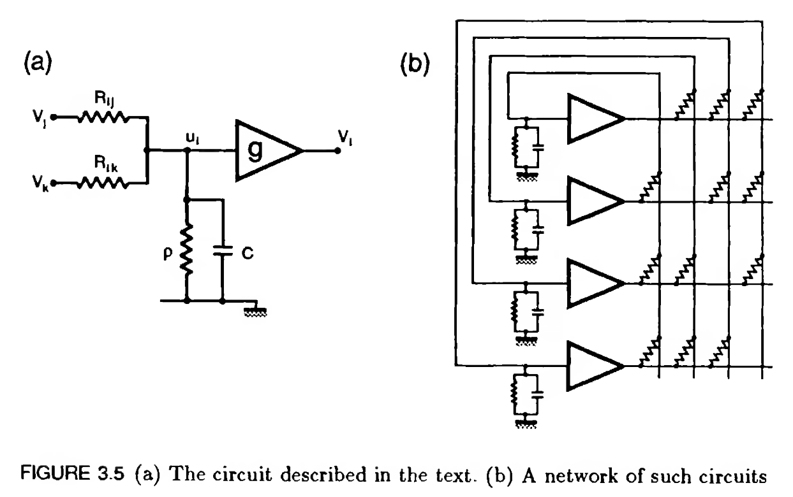
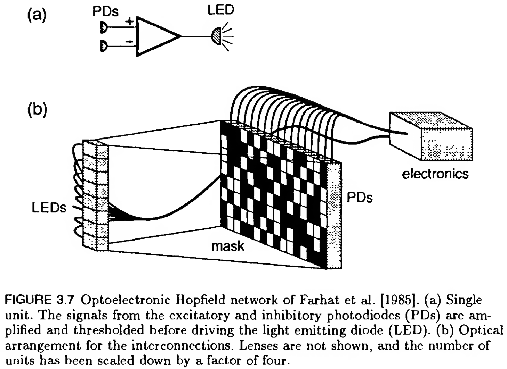

# BCSC: Artificial Neural Network

<table class="full-width">
  <tbody>
    <tr>
      <td style="text-align: center;">스터디장</td>
      <td style="text-align: left;">윤시원</td>
    </tr>
    <tr>
      <td style="text-align: center;">스터디원</td>
      <td style="text-align: left;">권가민, 박정욱, 이한나, 정윤호, 차민경</td>
    </tr>
    <tr>
      <td style="text-align: center;">기간</td>
      <td style="text-align: left;">27 Sep – 22 Nov 2026</td>
    </tr>
    <tr>
      <td style="text-align: center;">시간</td>
      <td style="text-align: left;">일 18:00–20:00</td>
    </tr>
    <tr>
      <td style="text-align: center;">장소</td>
      <td style="text-align: left;">사당역</td>
    </tr>
    <tr>
      <td style="text-align: center;">모집글</td>
      <td style="text-align: left;"><a href="https://naver.me/5kPfVLGc" target="_blank">https://naver.me/5kPfVLGc</a></td>
    </tr>
  </tbody>
</table>

## Introduction
1. 뇌의 지능을 컴퓨터에 구현하기 위한 노력을 탐구하고
2. 뇌를 모방한 신경망을 컴퓨터서 학습하기 위한 공학적 요소를 탐구합니다.
3. 최종적으로 (1)과 (2)의 bridge가 있는지 탐구합니다.

## Materials
### Main Materials
- Week 1–4: [*Introduction to the Theory of Neural Computation*](https://www.taylorfrancis.com/books/mono/10.1201/9780429499661/introduction-theory-neural-computation-john-hertz) — Hertz, Krogh, and Palmer
- Week 5: [A Fast Learning Algorithm for Deep Belief Nets](https://www.cs.toronto.edu/~hinton/absps/fastnc.pdf) — Geoffrey E. Hinton, Simon Osindero, and Yee-Whye Teh
- Week 6: [Attention is All You Need](https://arxiv.org/pdf/1706.03762) — Ashish Vaswani et al.
- Week 6: [Hopfield Network is All You Need](https://arxiv.org/pdf/2008.02217) — Hubert Ramsauer et al.

### Additional Materials
- Week 2: <https://www.youtube.com/watch?v=ozyNz5-2Ek0>
- Week 4: <https://www.youtube.com/watch?v=tk9FTdKOL5Q>
- Week 5: Deep Learning — Yann LeCun, Yoshua Bengio, and Geoffrey Hinton
- Week 6: <https://colah.github.io/posts/2014-03-NN-Manifolds-Topology/>
- Week 6: <https://jalammar.github.io/illustrated-transformer/>
- Week 7: [Dense Associative Memory for Pattern Recognition](https://arxiv.org/pdf/1606.01164) — Dmitry Krotov and John J. Hopfield
- Week 7: <https://ml-jku.github.io/hopfield-layers/>

## Schedule

| Week |  Date   | Contents (Slides)                                 | Presenter  |
| :--: | :-----: | :------------------------------------------------ | :--------: |
|  1   | 27 Sep  | [Overview & McCulloch-Pitts Neuron](./pdf/w1.pdf) |    윤시원    |
|  2   |  4 Oct  | [Hopfield Model I](./pdf/w2.pdf)                  |    차민경    |
|  3   | 11 Oct  | Hopfield Model II                                 |    권가민    |
|      | 18 Oct  | 시험 주간                                           |            |
|      | 25 Oct  | 시험 주간                                           |            |
|  4   |  1 Nov  | Boltzmann Machines                                |    박정욱    |
|  5   |  8 Nov  | Deep Learning (RBM, DBN)                          |    이한나    |
|  6   | 15 Nov  | Attention is All You Need & Memory                |    정윤호    |
|  7   | 22 Nov  | Hopfield Network is All You Need                  |    권가민    |

## Attendance

|  이름  | Week 1  | Week 2  | Week 3  | Week 4  | Week 5  | Week 6  | Week 7  |
| :---: | :-----: | :-----: | :-----: | :-----: | :-----: | :-----: | :-----: |
| 윤시원  |   ✅    |   ✅    |         |         |         |         |         |
| 권가민  |    ✔    |    ✔    |         |         |         |         |         |
| 박정욱  |   ✅    |   ✅    |         |         |         |         |         |
| 이한나  |   ✅    |   ✅    |         |         |         |         |         |
| 정윤호  |   ✅    |   ✅    |         |         |         |         |         |
| 차민경  |   ✅    |    ✔    |         |         |         |         |         |

✅: 출석,
✔: 비대면 출석,
❌: 무단결석

## Book

|  Date   | Amount (₩)  | Total (₩)  |
| :-----: | :---------: | :--------: |
| Sep 27  |   14,000    |   14,000   |
|  Oct 4  |   14,000    |   28,000   |

스터디룸 예약은 스터디 장이 진행하며, 스터디 마지막날 환급 금액 반영 후 정산 예정.

#### BCSC 환급 규칙:
- 모든 팀원이 최소 6회의 스터디에 모두 참여함: 1인당 7000원
- 모든 팀원이 최소 6회의 스터디에 모두 참여하지는 못했으나, 스터디 전체로 봤을 때는 대면 1회 포함 총 활동 6회를 충족했을 때: 1인당 5000원

## Memo

### Week 2
<figure>
  

    
    
  

  <figcaption>hardwares</figcaption>
</figure>

자세한 내용은 모르더라도, 우측 caption을 통해 Hopfield network를 회로로 규현하려는 시도임을 알 수 있습니다. 이 경우 hardware는 오직 neuron만으로 구성되는 것이 자연스러우며, 때문에 이 ‘computer’에는 clock을 전달하는 요소가 포함되지 아니하는 것이 자연스럽습니다.

추가로 Computer Sicence(CS)는 Computer에 관한 학문이 아닙니다. ( [MIT OpenCourseWareLecture 1A: Overview and Introduction to Lisp](https://www.youtube.com/watch?v=-J_xL4IGhJA&list=PLE18841CABEA24090) : CS를 computer에 대한 학문이라고 하는 것은 천문학이 망원경에 대한 학문이라고 말하는 것과 같습니다.) 저희 스터디의 목표 (1)은 `뇌의 지능을 컴퓨터에 모방하기 위한 노력을 탐구` 입니다. 여기서 computer를 우리가 실생활서 사용하는 computer로 한정한다면 다양한 공학적 요소는 필연적으로 따를 것입니다.

> An `associative memory model` using the `Hebb rule` for all possible pairs $$ij$$, with binary units and `asynchronous updating`, is usually called a **Hopfield model**.
> The term is also applied to various generalizations discussed in the next chapter. Although most of the ingredients of the model were known ezurlier, Hopfield’s influential paper [Hopfield, 1982] brought them together, introduced an energy function,and emphasized the idea of stored memories as dynamical attractors.

> The term `energy function` comes from a physical analogy to magnetic systems that we will discuss in the next section. But the concept is of much wider
> applicability; in many fields there is a state function that always decreases during dynamical evolution, or that must be minimized to find a stable or optimum state. In some fields the convention is reversed; the function increases or must be maximized. The most general name, from the theory of dynamic2d systems, is `Lyapunov function` [Cohen and Grossberg, 1983]. Other terms are `Hamiltonian` in statistical mechanics, `cost function` or `objective function` in optimization theory, and `fitness function` in evolutionary biology.

- 목적 여부
- local minimum vs. global minimum

## Discussion

### Week 2
- 💬 "에너지를 최소화한다"는 구조, 다른 곳에도 있을까?

- 💬 "기억한다"는 것은 무엇인가?
> Hopfield은 기억을 "에너지 최솟값에 수렴하는 것"으로 정의한다. 그런데 우리는 기억을 떠올릴 때마다 그 기억이 조금씩 변한다. Hopfield의 기억은 변하지 않는다. 그러면 "변하지 않는 기억"은 정말로 기억인가? 기억의 본질은 "고정된 것을 인출하는 것"인가, 아니면 "매번 다시 만드는 것"인가?

- 💬 우리는 "잊는다." 이 모델은 잊지 못한다.
> Hopfield network에서 저장된 패턴은 weight에 영구적으로 새겨진다. 망각이 없다. 그런데 인간에게 망각은 결함이 아니라 기능일 수 있다 — 불필요한 정보를 버려야 중요한 것에 집중할 수 있으니까. 망각 없는 기억 시스템이 정말로 지능적인가?

- 💬 왜 자석과 뇌가 같은 수학인가?
> Ising model은 자석이고 Hopfield은 뇌의 기억이다. 완전히 다른 시스템인데 같은 에너지 함수를 쓴다. 이것은 우연인가, 필연인가? "이진 상태의 상호작용 시스템"이면 어쩔 수 없이 같은 수학이 나오는 것인가? 수학이 같으면 "같은 현상"인가? 물이 흐르는 것도 전기가 흐르는 것도 같은 미분방정식을 따르는데, 그렇다고 물 = 전기인가?

- 💬 Spurious state: "있지도 않은 기억"은 버그인가?
> 저장한 적 없는 패턴이 안정 상태로 나타나는 것은 모델의 결함처럼 보인다. 하지만 인간의 뇌에서도 "있지도 않은 기억"이 생긴다 (false memory). 그리고 우리는 가끔 두 가지 경험을 혼합해서 완전히 새로운 아이디어를 만들어낸다. Spurious state가 "창의성"의 수학적 모델일 수 있는가?
