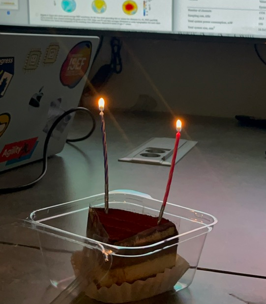
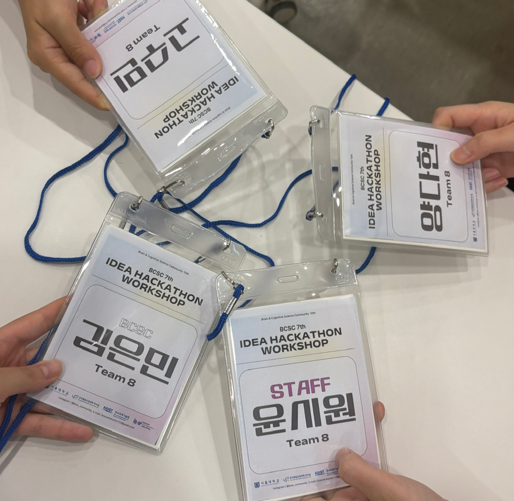

# BCSC

## 8th (1st Semester, 2025)
### Term 1. Data Analysis

#### Schedule

| 날짜         | 주제                                                        | 비고 |
| :---------- | :--------------------------------------------------------- | :-: |
| 1주차 (5/9)  | MATLAB Onramp                                              |     |
| 2주차 (5/16) | MATLAB 플롯으로 데이터 탐색                                     |     |
| 3주차 (5/17) | Plot Beyond the Second Dimension How MATLAB Graphics Work  |     |
| 4주차 (5/23) | Table                                                      |     |
| 5주차 (5/24) | Clean and Prepare Data for Analysis                        | 발제 |
| 6주차 (5/30) | Common Data Analysis Techniques                            |     |
| 7주차 (6/6)  | 데이터의 서브셋 찾기 및 추출                                      |     |
| 8주차 (6/27) | Project Session                                            |     |
{: .full-width }

#### Materials
- [MATLAB Onramp](https://matlabacademy.mathworks.com/kr/details/matlab-onramp/gettingstarted)
- [MATLAB 데이터 분석](https://matlabacademy.mathworks.com/kr/details/data-analysis-in-matlab/lpmldam)

#### Results
- [Card News](https://www.instagram.com/p/DLSK4O5yLjP/?utm_source=ig_web_copy_link&igsh=MzRlODBiNWFlZA==)
- [Report](https://cafe.naver.com/f-e/cafes/30493637/articles/901?menuid=73&referrerAllArticles=false)

### 자율스터디 — Guide to Research Techniques in Neuroscience{::nomarkdown}<figure class="sn"><figcaption>자율스터디 마지막 날</figcaption></figure>{:/}

#### Materials
- [*Guide to Research Techniques in Neuroscience*](https://www.amazon.com/Guide-Research-Techniques-Neuroscience-Carter/dp/0128186461) — Matt Carter, Rachel Essner, Nitsan Goldstein, and Manasi Iyer
- [뉴럴링크](https://product.kyobobook.co.kr/detail/S000211822458) — 임창환
- Papers

#### Results
- [Research Techniques in Neuroscience: Chapter 6](/bcsc/pdf/20250701-ResearchTechniquesInNeuroscienceChapter6.pdf)
- [논문리뷰: The Neurally Controlled Animat](/bcsc/pdf/20250810-%EB%85%BC%EB%AC%B8%EB%A6%AC%EB%B7%B0-The%20Neurally%20Controlled%20Animat.pdf)

### 5th IDEA HACKATHON
### Visit to [Korea Brain Research Institute (KBRI)](https://www.kbri.re.kr)
### Neuroinsight Workshop 2025

### Term 2. Science of Memory
Visit: [Science of Memory](/bcsc/science-of-memory/)

### Term 2. Network Neuroscience
#### Results
- [Poster](https://cafe.naver.com/bcscommunity/977)
- [Slides](/bcsc/pdf/20250817-GraphNeuralNetworksinNetworkNeuroscience.pdf)

### 기자단
#### Results
- [Article](/bcsc/pdf/%EC%9D%B8%EA%B3%B5%EC%A7%80%EB%8A%A5%EC%9D%98_%ED%99%95%EB%A5%A0%EC%A0%81_%EC%A0%91%EA%B7%BC.pdf)
- [Card News](https://www.instagram.com/p/DNFvcw_SDV8/?utm_source=ig_web_copy_link&igsh=MzRlODBiNWFlZA==)

## 9th (2nd Semester, 2025)
### Term 1. Statistics
#### Materials
- [Stanford “Introduction to Statistics” (Coursera)](https://www.coursera.org/learn/stanford-statistics/)
- [MIT “Statistics for Brain and Cognitive Science” (OCW)](https://ocw.mit.edu/courses/9-07-statistics-for-brain-and-cognitive-science-fall-2016/)

#### Results
- [Slides](/bcsc/pdf/20251111-ContinuousProbabilityModels.pdf)

### Term 1. Statistical Understanding on Deep Learning
#### Materials
- [Understanding Deep Learning Requires Rethinking Generalization](https://arxiv.org/pdf/1611.03530) — Chiyuan Zhang et al.
- [Approximation by Superpositions of a Sigmoidal Function](https://link.springer.com/article/10.1007/BF02551274) — G. Cybenko

### Term 2. Probabilistic Computational Neuroscience (Study Leader)
Visit: [Probabilistic Computational Neuroscience](/bcsc/probabilistic-computational-neuroscience/)

## 10th (1st Semester, 2026)
### Term 1. Artificial Intelligence
Visit: [Artificial Intelligence](/bcsc/artificial-intelligence/)
- 🥇 Outstanding Study Award — 1st Place

### 7th IDEA HACKATHON
- 7–9 Aug 2026
- 🥇🥇🥇 Team 8{::nomarkdown}<figure class="sn"><figcaption>7th idea hackathon</figcaption></figure>{:/} — 1st Place

#### Photos
- [Instagram Post I](https://www.instagram.com/p/Dbwrx7YCfbP/?utm_source=ig_web_copy_link&igsh=MzRlODBiNWFlZA==)
- [Instagram Post II](https://www.instagram.com/p/DbyZfiwkzlx/?utm_source=ig_web_copy_link&igsh=MzRlODBiNWFlZA==)

#### Results
- [Slides](/bcsc/pdf/20260810-bcsc_hackathon.pdf)

### Term 2. Extracting Biomarkers from Grayscale
### Term 2. Neural Speech Decoding for Brain Computer Interfaces