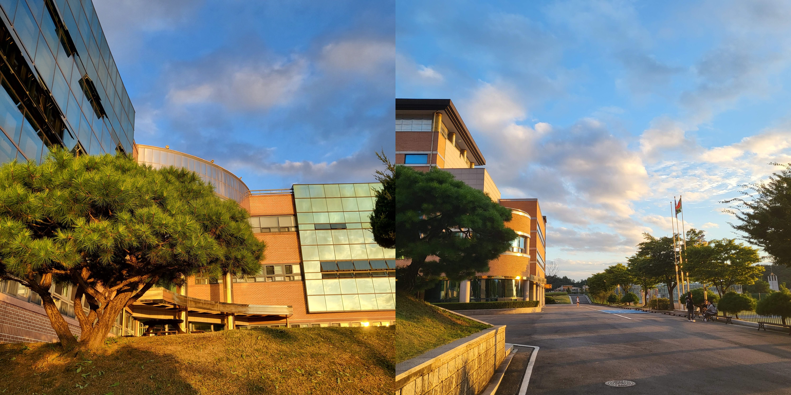
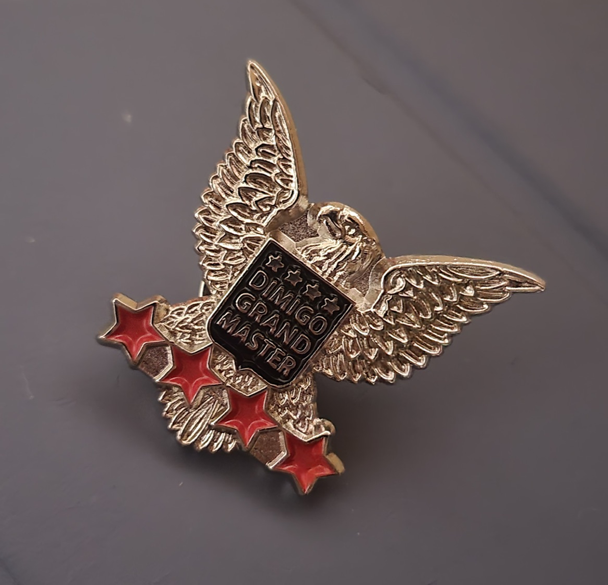

# [Korea Digital Media High School (KDMHS, DIMIGO)](https://dimigo.hs.kr)
- Ansan, South Korea
- 21st Cohort [March 2022 – January 2025]
- Dept. of Web Programming

<figure>
  
  <figcaption>Dimigo</figcaption>
</figure>

## 디미고 IT역량 UP 프로그램
- 🏆 GrandMaster — 2nd of 189 [2024]{::nomarkdown}<figure class="sn"><figcaption>grand master badge</figcaption></figure>{:/}

## Coursework
### 1st Year
- General Subjects: Korean, Integrated Mathematics, Integrated Science, English, Physical Education, Social Studies, Music, Art, Vocational Studies
- Major Subjects: C Programming, Internet of Things (IoT), Computer Systems

### 2nd Year
- General Subjects: Korean History, Korean Literature, English, Physical Education, Mathematics, Differential and Integral Calculus, Physics, Chemistry, Vocational Studies, Chinese
- Major Subjects: Web Programming, Engineering Mathematics
- AI Course: Data Structures

### 3rd Year
- General Subjects: Korean Classical Literature, English, Industry Studies
- Major Subjects: Database, Web Programming, Engineering Mathematics
- AI Courses: Big Data, Artificial Intelligence

## School Clubs
- 🌿 Fregic (12th Generation) — Artificial Intelligence (AI) Study Club
- Turing (1st Generation) — Artificial Intelligence (AI) Research Lab
