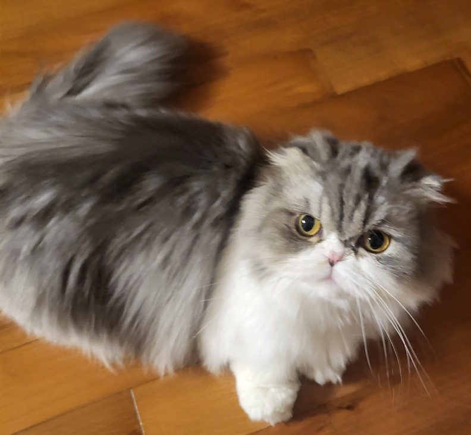
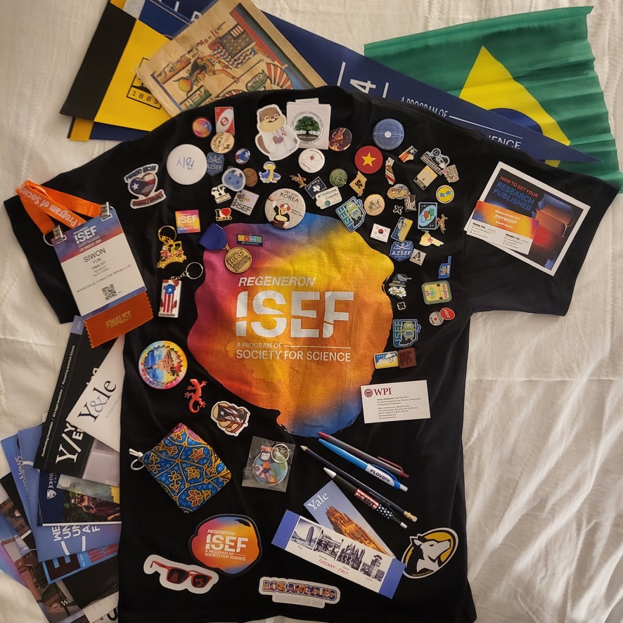
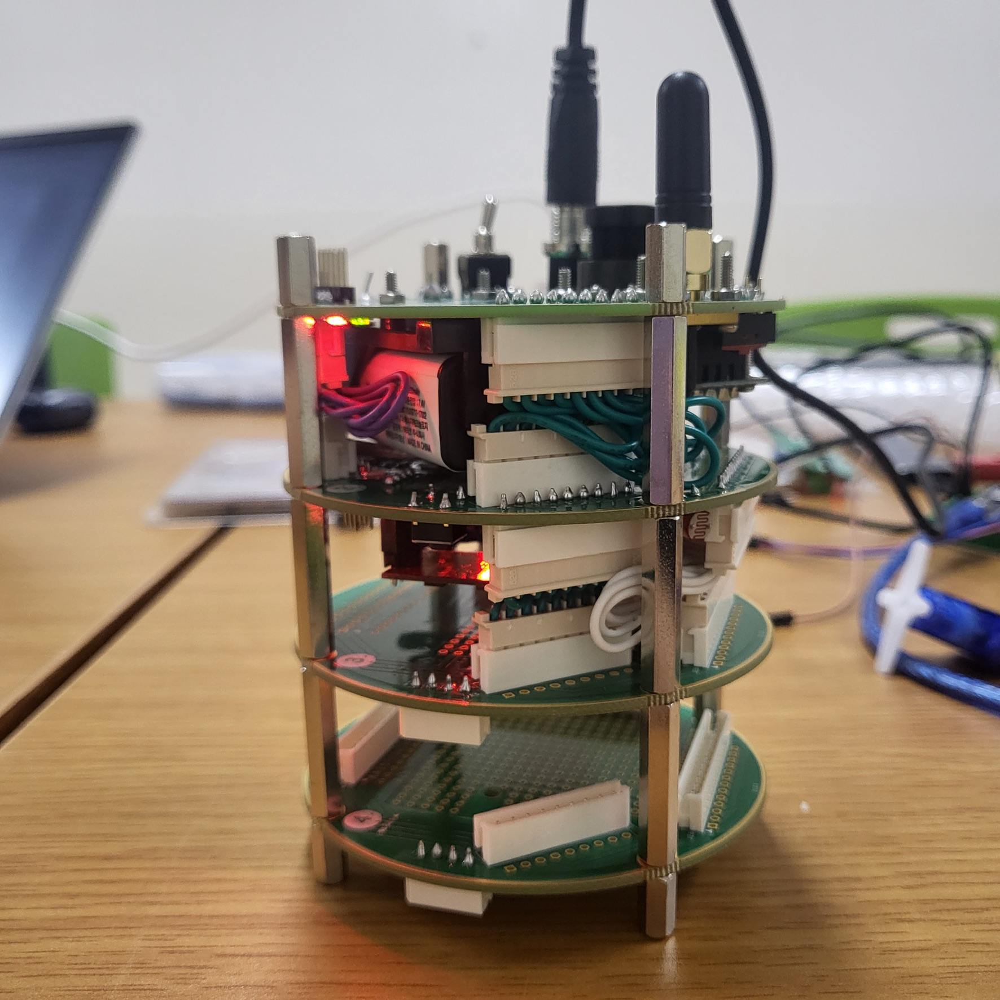

# Siwon Yun (윤시원, 尹時元)
> 나는 젤리가 없어도 달콤한 냄새가 나

    <figure>
        
        <figcaption>my cat, Goorm</figcaption>
    </figure>

## Contact
Email: yswysw421[at]gmail[dot]com\\
GitHub: [Siwon Yun](https://github.com/siwonyun/)\\
LinkedIn: [i-love-you](https://www.linkedin.com/in/i-love-you/)

## Selected Honors & Awards
- Regeneron International Science and Engineering Fair ([ISEF](https://www.societyforscience.org/isef/)) 2024{::nomarkdown}<label for="sn-isef" class="sidenote-toggle sidenote-number"></label><input type="checkbox" id="sn-isef" class="sidenote-toggle"><figure class="sidenote"><figcaption>ISEF</figcaption></figure>{:/}
    - Los Angeles, CA
    - Finalist, Society for Science [May 2024]
- 디미고 IT역량 UP 프로그램
    - GrandMaster 등급(2 of 189) [2024]
- Smarteen App+ Challenge (STAC) 2023
    - Bronze Medal, SK Planet / Ministry of SMEs and Startups [Oct 2023]
- E-icon World Contest 2022
    - Bronze Medal, Ministry of Education [2022]

## Experience
- Brain and Cognitive Science Community ([BCSC](https://bcscommunity123.wixstudio.com/bcsc)) [Mar 2025 - Current]
    - Committee Member [Mar 2026 - Current]
- [GAI Lab](https://sites.google.com/view/gailab/)
    - Intern [Sep 2025 - Current]
- [Quantum Information Science Summer School](https://qschool.info) 2025
    - Quantum Information Research Support Center [11 Jan - 16 Jan 2025]
- [Counterspell: Seoul](https://counterspell-seoul.vercel.app)
    - Co-organizer, [Hack Club](https://hackclub.com/) [23 Nov - 24 Nov 2024]
- KAIST Creative and Global Leader Program (창의적 글로벌 리더 프로그램) 2023 Summer
- [CANSAT COMPETITION KOREA](https://cansat.kaist.ac.kr) 2023{::nomarkdown}<label for="sn-cansat" class="sidenote-toggle sidenote-number"></label><input type="checkbox" id="sn-cansat" class="sidenote-toggle"><figure class="sidenote"><figcaption>cansat</figcaption></figure>{:/}
    - First round qualifier selection
- Korean Scholars Conference for Youth (KSCY) 2023
    - Official Ambassadors, Computer Engineering Research Track

## Education
- [Incheon National University](https://inu.ac.kr), Incheon, Republic of Korea
    - B.S., [Computer Science](https://cse.inu.ac.kr/)(Expected 2027) [Mar 2025 - Current]
    - Grade: 4.4/4.5
- [Korea Digital Media High School](https://dimigo.hs.kr/), Ansan, Republic of Korea
    - Dept. web programming [Mar 2022 - Jan 2025]
